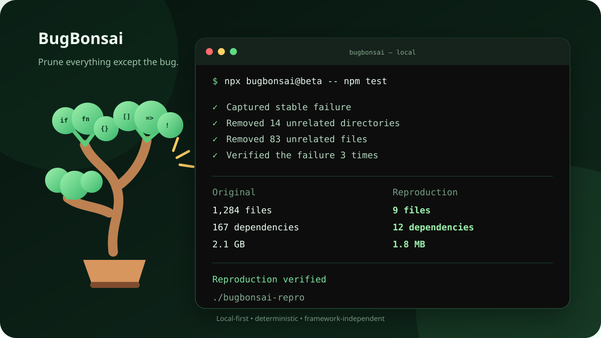

# BugBonsai

> Prune everything except the bug.

BugBonsai turns a failing JavaScript or TypeScript project into a small, shareable reproduction while continuously verifying that the original failure still exists.



```bash
npx bugbonsai -- npm test
```

BugBonsai is local-first, deterministic, durably resumable at command boundaries, and deliberately conservative. It never uploads source code or modifies existing files in the source project. Even baseline commands run inside disposable workspaces.

## Thirty-second quick start

From the project containing a stable failing command:

```bash
npx bugbonsai -- npm test
```

For a noisy failure, provide a distinctive fragment:

```bash
npx bugbonsai --match "Hydration failed" -- pnpm build
npx bugbonsai --match-regex "TS\\d{4}" -- pnpm typecheck
```

BugBonsai writes the verified reproduction to `./bugbonsai-repro` by default:

```text
🌱 BugBonsai

✓ Failure reproduced 2/2
✓ remove 83 files under docs
✓ remove devDependencies.storybook
✓ Final failure reproduced 3/3

Reproduction verified

Original        1,284 files, 2.10 GB
Reproduction    9 files, 1.80 MB
```

## How it works

1. Inventory the source project without running its command.
2. Copy it into an isolated session workspace.
3. Capture the failure repeatedly to reject unstable baselines.
4. Build a conservative import graph and propose large, unreachable removals before small ones.
5. Run the command after each mutation.
6. Accept only mutations that match the structured failure oracle.
7. Scan, freshly install, and revalidate the export.

After every candidate, BugBonsai atomically persists the current reducer, generation, deterministic mutation schedule, next mutation, cache, elapsed time, dependency snapshot, and consumed run budget. `bugbonsai resume` continues the same run rather than creating a replacement session or repeating completed candidates.

The result is the smallest practical reproduction BugBonsai found within the configured run budget. It is not a mathematical guarantee of the global minimum.

## CLI

```text
bugbonsai [options] -- <command> [...arguments]

-o, --output <directory>
--root <directory>
--match <text>
--match-regex <pattern>
--exit-code <number>
--oracle <file>
--plugin <specifier>
--plugin-oracle <name>
--archive <file>
--dockerfile
--github-issue
--timeout <duration>
--stability-runs <number>
--final-runs <number>
--max-runs <number>
--mode <fast|balanced|thorough>
--keep <glob>
--exclude <glob>
--include <glob>
--skip-reducer <name>
--only-reducer <name>
--install-command <command>
--allow-install-scripts
--no-install
--json
--quiet
--verbose
--no-color
```

Arguments after `--` are passed directly to the executable without reconstruction as a shell string. Pipes, redirects, environment assignments, and other shell syntax are intentionally not interpreted.

For a command run inside a workspace package, select the ancestor project root while invoking BugBonsai from the package:

```bash
cd apps/web
npx bugbonsai --root ../.. -- pnpm test
```

The generated instructions preserve `apps/web` as the command working directory.

## Configuration

An optional `bugbonsai.config.mjs` in the invocation directory provides project defaults. CLI arguments take precedence.

```js
/** @type {import("bugbonsai").BugBonsaiConfig} */
export default {
  root: "../..",
  mode: "balanced",
  timeout: "90s",
  keep: ["fixtures/**"],
  reducers: {
    dependencies: true,
    tests: true,
  },
  oracle: {
    match: "PAYMENT_STATE_CORRUPTED",
  },
};
```

The configuration is a trusted local ESM module and may execute JavaScript when loaded. See [docs/configuration.md](docs/configuration.md).

Additional diagnostics:

```bash
bugbonsai doctor
bugbonsai doctor --json
bugbonsai resume
bugbonsai clean
bugbonsai clean --all
```

## Failure matching

The default oracle combines exit behavior, error identity, normalized output tokens, and stack-frame overlap. It rejects common candidate-created setup failures such as missing modules unless that was the original failure.

Use `--match` when the output contains a stable sentinel. Use `--match-regex` for variable but structured errors. `--exit-code` is a secondary constraint and should not be used as the only evidence when many unrelated failures share the same code.

When output matching is domain-specific, provide a trusted local ESM predicate with `--oracle ./bugbonsai.oracle.mjs`. See [docs/failure-oracles.md](docs/failure-oracles.md).

## Reducers

The engine includes:

- hierarchical directory and file pruning;
- adaptive coarse-to-fine `ddmin` partitions for files, manifests, configuration, and dependencies;
- `package.json` metadata and unused-script pruning;
- import-aware direct dependency pruning with clean candidate installation and lockfile refresh;
- recursive JSON/JSONC object-property and array-element pruning;
- conservative Oxc span-based top-level JavaScript, TypeScript, JSX, and TSX pruning;
- thorough-mode function-block, branch, class-member, switch-case, object, array, and JSX pruning;
- nested Vitest/Jest suite, test, hook, `.each`, `.skip`, and `.only` pruning;
- evidence-based TypeScript, Vitest, Jest, Vite, and Next.js adapters.

`fast` skips dependency and source reduction. `balanced` is the default. `thorough` enables deeper syntax candidates for function blocks, branches, classes, switches, objects, arrays, and JSX.

Rejected candidates are cached by project content, command, oracle, normalized baseline, BugBonsai version, and a one-way environment fingerprint. A cache hit can skip a known rejection, but cached results are never used to accept a mutation.

Dependency candidates begin from a private copy of the last verified `node_modules` snapshot before the package manager refreshes it. This avoids rebuilding every candidate from an empty installation while ensuring mutations cannot modify the shared accepted snapshot.

## Plugins

Trusted ESM plugins can contribute domain-specific reducers, framework adapters, package-manager providers, and named failure oracles:

```bash
bugbonsai --plugin ./bugbonsai.plugin.mjs \
  --plugin-oracle acme/hydration \
  -- npm test
```

Plugin components are namespaced as `plugin/component`, validated against API version `1`, and fingerprinted for cache and resume compatibility. Plugins are explicit and never auto-discovered. See [docs/plugins.md](docs/plugins.md) and the shipped [complete example](examples/plugins/full-example.mjs).

## Portability and sharing

Every reproduction includes a content-addressed `bugbonsai-manifest.json`. Recipients can check the complete file tree and reproduce the exported failure with:

```bash
npx bugbonsai verify ./bugbonsai-repro
```

Use `--archive ./repro.zip` for a deterministic ZIP plus `.sha256` sidecar, `--dockerfile` for `Dockerfile.bugbonsai`, and `--github-issue` for an attachment-ready issue body. Environment-variable names are recorded without values, and an absolute current Node executable is normalized to `node`. See [docs/sharing.md](docs/sharing.md).

## Package managers

npm and pnpm are the primary validated paths. Package-manager declarations, every detected lockfile, and npm/pnpm workspace layouts are recorded in diagnostics and reports. If several package-manager lockfiles exist without an authoritative `packageManager` declaration, BugBonsai stops and asks for an explicit declaration or `--install-command` instead of guessing.

Accepted dependency removals regenerate installation metadata in the isolated candidate and verify that the selected lockfile remains present. Yarn and Bun are detected and have conservative install commands, but complex workspace and Plug'n'Play layouts still require additional field validation.

Dependency lifecycle scripts are disabled by default. Pass `--allow-install-scripts` only after reviewing the project’s dependencies.

## Security and privacy

BugBonsai does not use telemetry or upload code. It excludes common credential files and scans the final output for high-confidence secret patterns.

Filesystem isolation is not an OS security sandbox. The supplied command can still access the network, processes, user services, and inherited environment. Run untrusted projects in an operating-system sandbox or disposable machine. Heuristic secret scanning cannot prove that an export is secret-free; review it before publishing.

See [docs/security.md](docs/security.md) for the complete model.

## Beta readiness

Compatibility claims are exercised by a manifest-driven corpus on Linux,
Windows, and macOS across supported Node releases. Versioned performance budgets
fail CI on run-count, reduction-quality, cache, or material duration regressions.
The fault suite covers intermittent commands, failed installers, hostile output,
corrupt state, interruptions, and tampered exports. See
[docs/beta-validation.md](docs/beta-validation.md).

The evidence-backed support levels are published in
[COMPATIBILITY.md](COMPATIBILITY.md). Beta installation, feedback, and privacy
guidance lives in [docs/public-beta.md](docs/public-beta.md).

## Programmatic API

```ts
import { reduceProject } from "bugbonsai";

const result = await reduceProject({
  cwd: process.cwd(),
  command: ["pnpm", "test"],
  output: "./minimal-repro",
  match: "PAYMENT_STATE_CORRUPTED",
});

console.log(result.outputDirectory);
```

## Current limitations

- Candidate execution is sequential for correctness.
- Plugins are trusted in-process code, not isolated extensions.
- Workspace installation and direct dependency pruning operate from an explicit root; Yarn Plug'n'Play, Bun workspaces, catalogs, and package-manager-specific patch/protocol edge cases remain conservative.
- BugBonsai isolates project files, not network or external-service side effects.
- Failure and secret matching are heuristic and intentionally favor false rejection over preserving the wrong failure.

## Development

```bash
pnpm install
pnpm typecheck
pnpm lint
pnpm test
pnpm build
pnpm corpus
pnpm benchmark:check
pnpm pack:check
```

See [CONTRIBUTING.md](CONTRIBUTING.md), [ARCHITECTURE.md](ARCHITECTURE.md), [docs/how-it-works.md](docs/how-it-works.md), and [docs/releasing.md](docs/releasing.md).

## License

MIT
